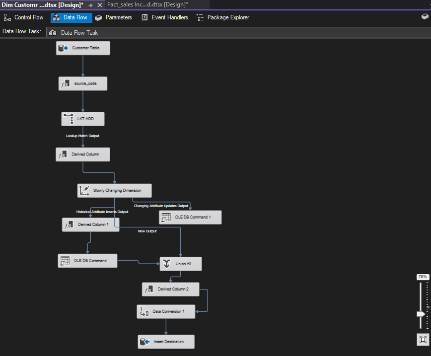

<h2>Project Overview</h2>

This project involves building a Data Warehouse (DWH) for a mart sales system using the AdventureWorks database as the source. The Data Warehouse is designed to enable efficient analysis and reporting of sales data, incorporating modern ETL techniques with SQL Server Integration Services (SSIS). The project uses Slowly Changing Dimensions (SCD) Type 1 and Type 2 to track changes in dimensional data and implements an incremental load process to handle updates and new data.

<h2>Objectives</h2>
<ul>
    <li>Create a comprehensive Data Warehouse for mart sales analysis.</li>
    <li>Design and implement ETL processes using SSIS.</li>
    <li>Utilize SCD Type 1 and Type 2 for tracking changes in dimensions.</li>
    <li>Implement incremental loading to optimize data integration.</li>
</ul>

<h2>Data Warehouse Design</h2>
<h3>Source</h3>

<strong>AdventureWorks Database</strong>: A pre-existing transactional database that serves as the source for the Data Warehouse.

<h3>Dimensions</h3>
<ul>
    <li><strong>Product Dimension</strong> 🛍️: 
        Attributes: Product ID, Product Name, Product Category, Product Subcategory, Product Price. 
        Tracks changes using SCD Type 2. 
        
    </li>
    <li><strong>Date Dimension</strong> 📅: 
        Attributes: Date Key, Full Date, Year, Quarter, Month, Week, Day. 
        Preloaded with a complete range of dates. 
        
    </li>
    <li><strong>Customer Dimension</strong> 🧍‍♂️🧍‍♀️: 
        Attributes: Customer ID, Full Name, Email, Phone, Address. 
        Tracks changes using SCD Type 1. 
        
    </li>
    <li><strong>Territory Dimension</strong> 🌍: 
        Attributes: Territory ID, Territory Name, Region, Country. 
        Tracks changes using SCD Type 2. 
        
    </li>
</ul>

<h3>Fact Table</h3>

<strong>Sales Fact</strong> 📈: 
    Measures: Sales Amount, Quantity, Discount, Tax. 
    Foreign Keys: Product ID, Date Key, Customer ID, Territory ID. 
    

<h3>DWH Schema</h3>

Below is the schema for the Data Warehouse, which includes the dimension and fact tables:

<h2>ETL Process</h2>
<h3>Tools and Techniques</h3>
<ul>
    <li><strong>SSIS</strong> (SQL Server Integration Services): Used to extract, transform, and load data from the AdventureWorks database into the Data Warehouse.</li>
    <li><strong>Incremental Load</strong>: Ensures only new or updated records are processed by checking the last loaded value in each ETL execution.</li>
    <li><strong>SCD Implementation</strong>: 
        - Type 1: Directly overwrites the old data for the Customer Dimension. 
        - Type 2: Maintains history by creating a new row with versioning for the Product and Territory Dimensions.</li>
</ul>

<h3>Steps</h3>
<ol>
    <li><strong>Extraction</strong>: 
        Source: AdventureWorks database. 
        Extract tables: Products, Customers, Sales, Territories, and Date-related data.</li>
    <li><strong>Transformation</strong>: 
        Clean and standardize data. 
        Apply SCD Type 1 for Customer Dimension. 
        Apply SCD Type 2 for Product and Territory Dimensions. 
        Aggregate sales data for the fact table.</li>
    <li><strong>Loading</strong>: 
        Load dimensions first (Product, Date, Customer, Territory). 
        Load Sales Fact Table using foreign keys from dimensions.</li>
    <li><strong>Incremental Loading</strong>: 
        Use "last updated" timestamp to load only new/modified data.</li>
</ol>

<h2>Deliverables</h2>
<ul>
    <li><strong>SSIS Packages</strong>: 
        ETL workflows for all dimensions and the fact table. 
        Incremental load configurations. 
        SCD implementation packages.</li>
    <li><strong>Data Warehouse Schema</strong>: 
        Dimension and Fact tables with indexes for optimized querying.</li>
    <li><strong>Documentation</strong>: 
        Comprehensive README detailing the design, ETL process, and SSIS packages. 
        SQL scripts for schema creation.</li>
</ul>

<h2>Key Features</h2>
<ul>
    <li><strong>Scalable and Flexible</strong>: Designed to support future extensions and additional dimensions or facts.</li>
    <li><strong>Historical Tracking</strong>: SCD Type 2 allows tracking historical changes for critical dimensions.</li>
    <li><strong>Optimized Loading</strong>: Incremental load minimizes data processing time.</li>
</ul>

<h2>CV Entry</h2>

<strong>Project Name</strong>: Mart Sales Data Warehouse 
    <strong>Description</strong>: Designed and implemented a Data Warehouse for mart sales analysis using AdventureWorks database. Built ETL processes in SSIS with incremental loading and Slowly Changing Dimensions (SCD) Type 1 and Type 2. Developed star schema with Product, Date, Customer, and Territory dimensions and a Sales fact table. Enabled efficient querying and reporting. 
    <strong>Key Tools</strong>: SQL Server, SSIS, AdventureWorks, SCD Type 1 & Type 2, Incremental Load.

    

